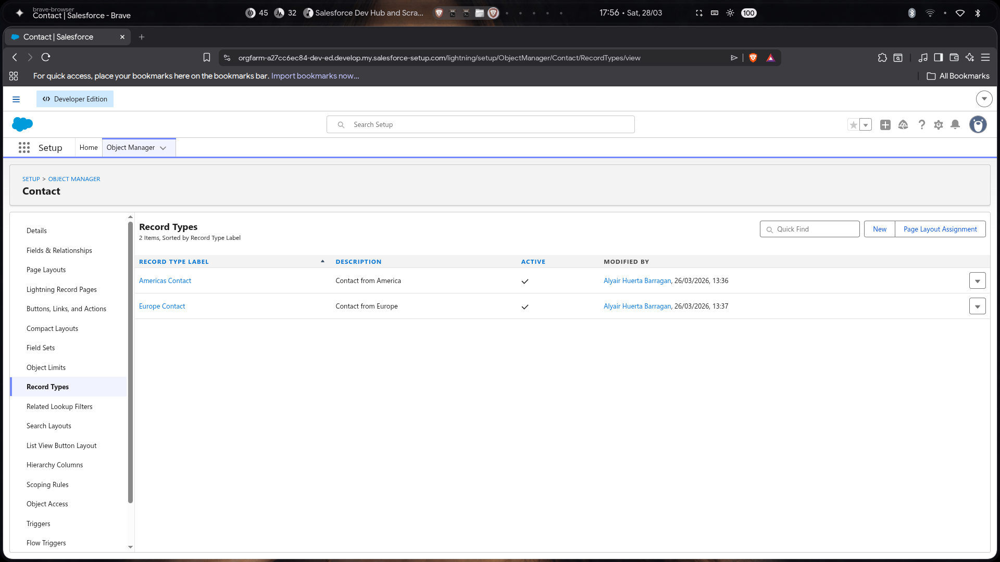
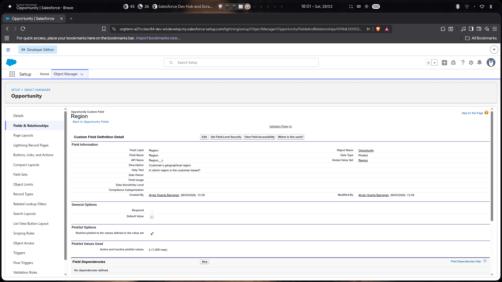
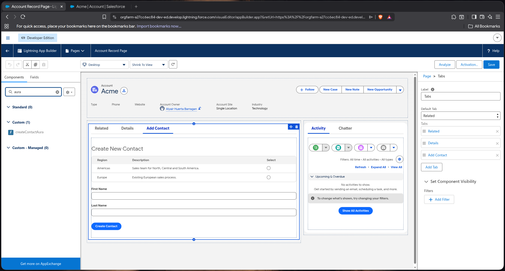
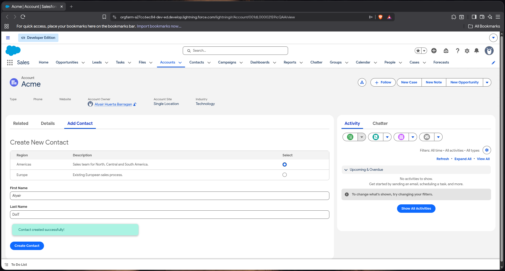
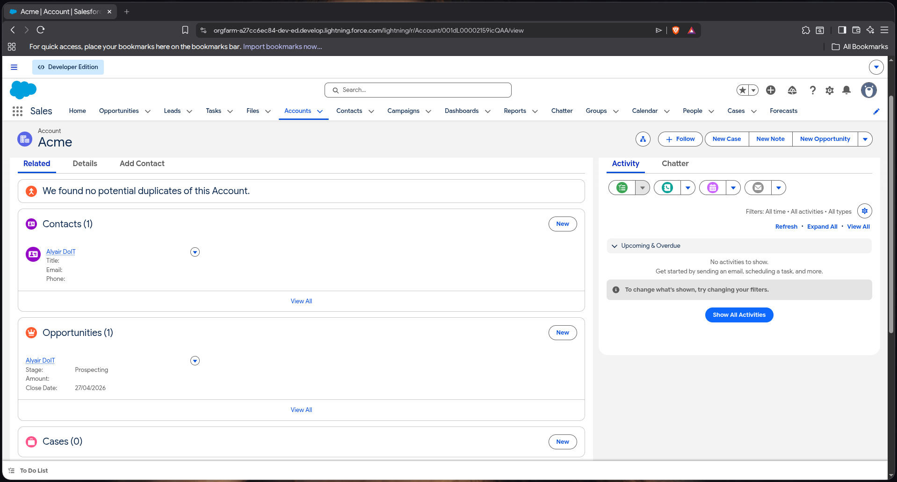
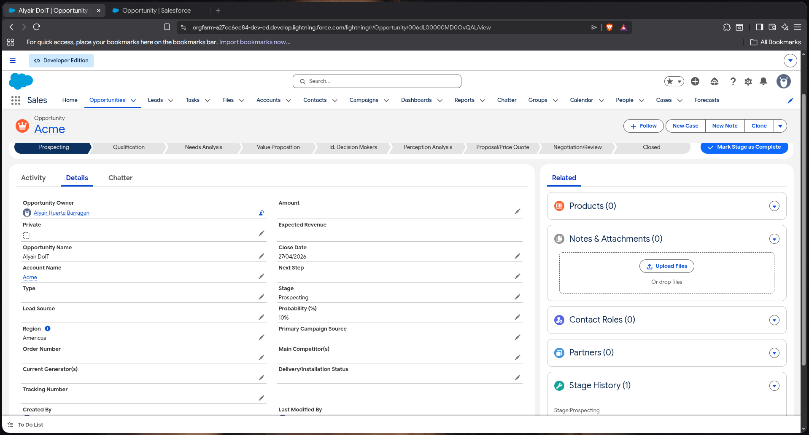

# Technical Test - Acme

## Descripción

Este proyecto implementa un componente Aura en Salesforce que permite crear Contactos con RecordTypes por región. Al crear un Contacto, un Trigger automáticamente genera una Oportunidad asociada a la misma Cuenta.

## Componentes del Proyecto

### Aura Component: `createContactAura`

Componente Lightning para la creación de Contactos con selección de región.

**Funcionalidades:**

- Selección de región (Americas / Europe)
- Campos: First Name, Last Name, Account(La cuenta es obtenida a partir de la url de la account view)
- Mensajes de éxito/error

`createContactControllerAura`

Clase AuraEnabled que maneja la creación del Contacto en Salesforce.

 `contactTrigger`

Trigger en el objeto Contact que ejecuta lógica en dos eventos:

- Consulta los RecordTypes de los contactos insertados
- Mapea RecordTypes a regiones
- Crea una Oportunidad por cada Contacto con:
  - **Name**: `[FirstName] [LastName]`
  - **AccountId**: Mismo que el Contacto
  - **StageName**: `Prospecting`
  - **CloseDate**: Hoy + 30 días
  - **Region__c**: Región correspondiente

- Detecta cambios en el nombre del Contacto
- Actualiza el nombre de las Oportunidades asociadas con el mismo AccountId y nombre anterior
- Usa `triggerHandler` para prevenir recursión

### Trigger Handler: `triggerHandler`

Clase utilitaria con flags estáticos para prevenir triggers recursivos:

- `contactRunning`: Evita loop en contactTrigger → opportunityTrigger
- `opportunityTRunning`: Evita loop en opportunityTrigger → contactTrigger

## Flujo

```
┌─────────────────────────────────────────────────────────────┐
│                    Usuario llena formulario                 │
│  - First Name: Alyair                                       │
│  - Last Name: DoIT                                          │
│  - Region: Americas                                         │
│  - Account: se obtiene a traves de la URL                   │
│                                                             │
└─────────────────────────────────────────────────────────────┘
                            │
                            ▼
┌─────────────────────────────────────────────────────────────┐
│         createContactAuraHelper.createContact()             │
│         - Invoca Apex Action: createContact()               │
└─────────────────────────────────────────────────────────────┘
                            │
                            ▼
┌─────────────────────────────────────────────────────────────┐
│         createContactControllerAura.createContact()         │
│         - Obtiene RecordTypeId por DeveloperName            │
│         - Crea Contact con AccountId                        │
│         - INSERT Contact                                    │
└─────────────────────────────────────────────────────────────┘
                            │
                            ▼
┌─────────────────────────────────────────────────────────────┐
│              contactTrigger (after insert)                  │
│         - Obtiene RecordTypes consultando por Id            │
│         - Mapea region desde rtRegion map                   │
│         - Crea Opportunity por cada Contact c/AccountId     │
│         - INSERT Opportunities                              │
└─────────────────────────────────────────────────────────────┘
                            │
                            ▼
┌─────────────────────────────────────────────────────────────┐
│                   Resultado Final                           │
│  Contact: Alyair DoIT (Americas_Contact) → Account: Acme    │
│  Opportunity: Alyair DoIT (Prospecting, CloseDate+30)       │
└─────────────────────────────────────────────────────────────┘
```

## Requisitos

Crear los siguientes RecordTypes para Contact:

- `Americas_Contact` (Label: "Americas Contact")
- `Europe_Contact` (Label: "Europe Contact")



- PickList de Opportunity

El campo Region es creado en el objeto oportunidad como un picklist asociado a una PickList global

- `Region__c` en Opportunity



## Instalación

1. Desplegar el código usando Salesforce CLI:

   ```bash
   sf project deploy start -d force-app
   ```

## Uso

1. Agregar el componente `createContactAura` a una Lightning Page

Una manera de integrar este componente es accediendo a la pestaña "Edit Page" en el icono del engrane ⚙️ es posible editar la pagina actual de donde vamos a querer usar
nuestro componente en este caso la pestaña de cuenta;


Dentro del Lightning App Builder podemos Agregar una nueva tab al componente Tabs que nos proporciona Accounts
podremos agregar un nuevo componente, dentro de este arrastraremos nuestro componente de Aura



1. Completar el formulario:
   - Seleccionar región (Americas o Europe)
   - Ingresar First Name y Last Name

2. Click en "Add Contact"
3. El Contacto y la Oportunidad asociada debería haberse creado de manera correcta

- Rellenado de formulario


- Verificacion en Account



- Detalles de la oportunidad

